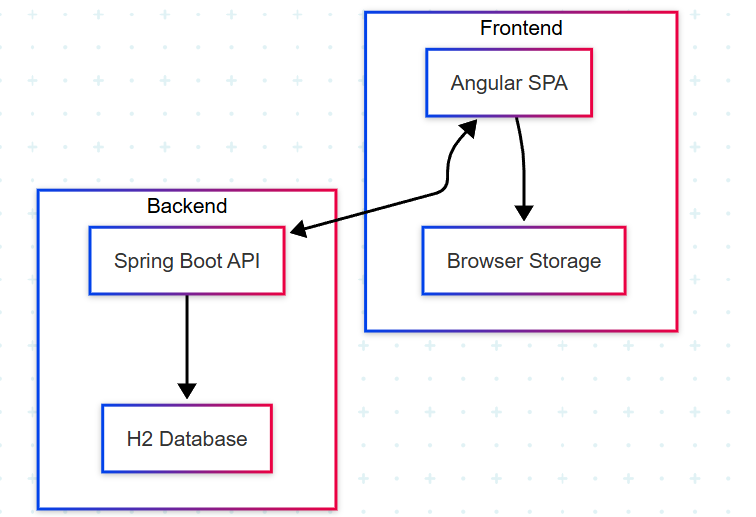
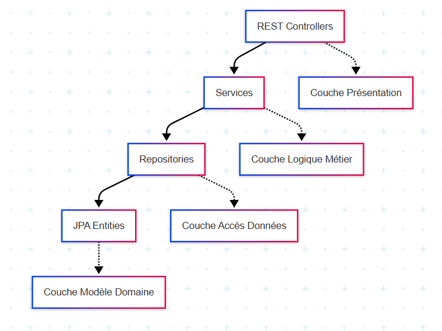
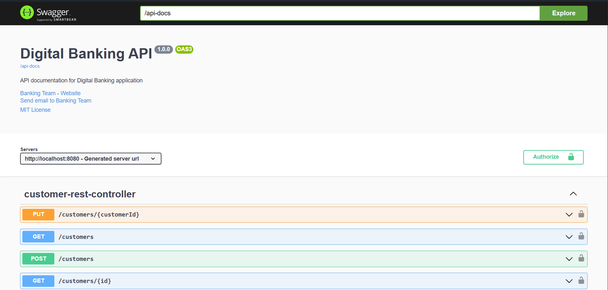
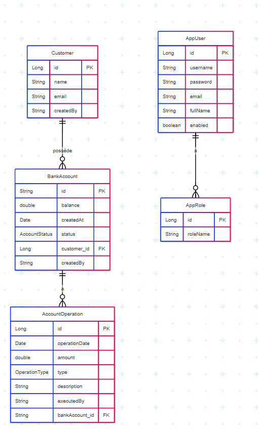
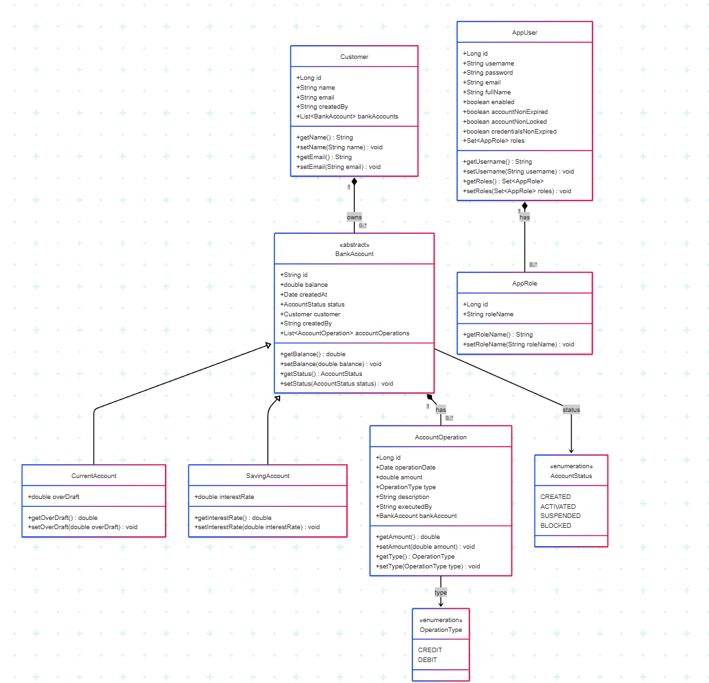
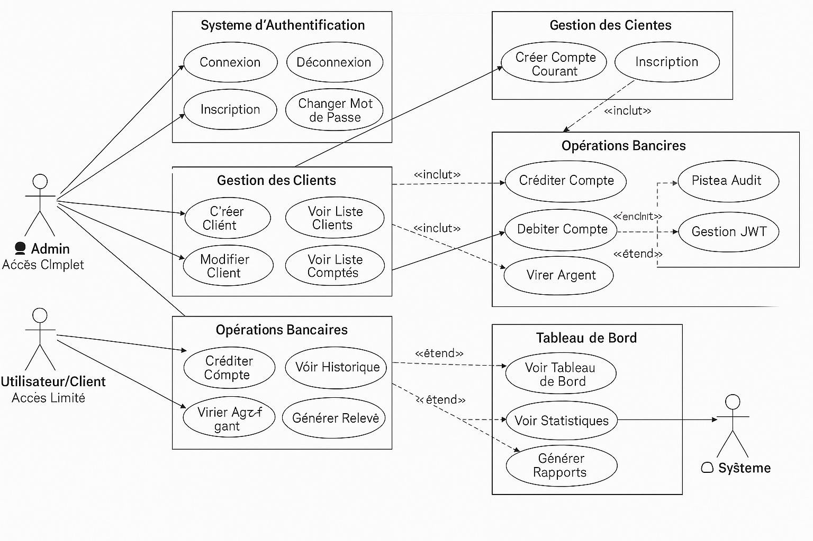
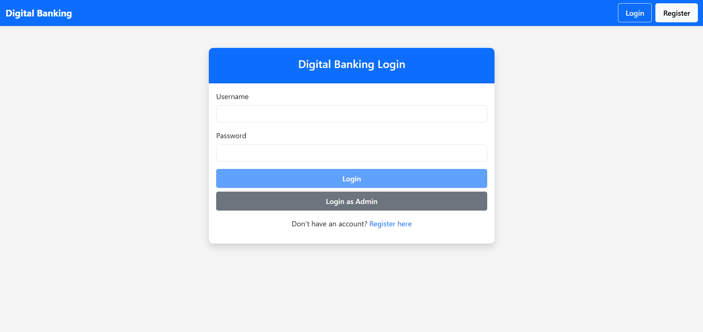
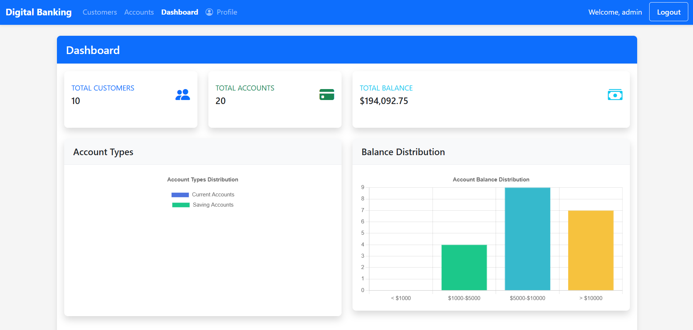
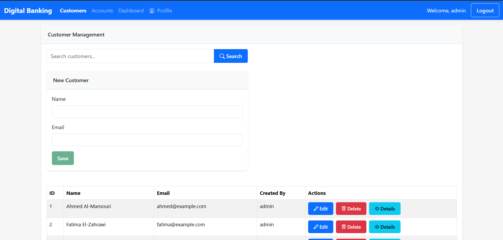
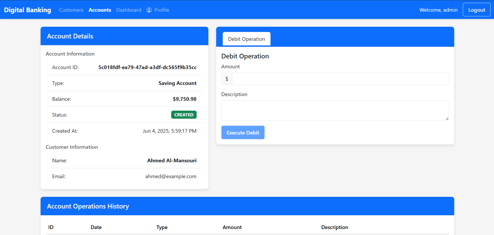

# 🏦 Application Bancaire Numérique

Un système complet de gestion bancaire développé avec **Spring Boot** et **Angular**, intégrant l'authentification JWT, le contrôle d'accès basé sur les rôles et les technologies web modernes.
- **Réalisé ELBATIR Elmahdi** - *Développement full-stack et implémentation*
- **Encadré par YOUSSFI Mohamed** - *Supervision académique et guidance*

## 📋 Table des Matières

- [Aperçu du Projet](#-aperçu-du-projet)
- [Architecture](#-architecture)
- [Technologies Utilisées](#-technologies-utilisées)
- [Fonctionnalités](#-fonctionnalités)
- [Structure du Projet](#-structure-du-projet)
- [Installation et Configuration](#-installation-et-configuration)
- [Documentation API](#-documentation-api)
- [Implémentation de la Sécurité](#-implémentation-de-la-sécurité)
- [Schéma de Base de Données](#-schéma-de-base-de-données)
- [Diagramme de Classes](#-diagramme-de-classes)
- [Diagramme de Cas d'Usage](#-diagramme-de-cas-dusage)
- [Fonctionnalités Frontend](#-fonctionnalités-frontend)
- [Tests](#-tests)
- [Captures d'Écran](#-captures-décran)
- [Contribution](#-contribution)

## 🎯 Aperçu du Projet

Cette application Bancaire Numérique est une solution full-stack qui démontre les pratiques de développement de niveau entreprise avec un backend Spring Boot et un frontend Angular. Le système gère les clients, les comptes bancaires et les opérations financières avec une sécurité complète et des pistes d'audit.

### Objectifs Clés
- ✅ **Partie 1**: Backend Spring Boot avec entités JPA, repositories, services et contrôleurs REST
- ✅ **Partie 2**: Frontend Angular avec UI/UX moderne et design responsive
- ✅ **Partie 3**: Authentification et autorisation basées sur JWT avec Spring Security

## 🏗️ Architecture

L'application suit une **architecture en couches** avec une séparation claire des préoccupations :



### Architecture Backend



### Architecture Frontend
## 🛠️ Technologies Utilisées

### Backend
- **Spring Boot 3.4.5** - Framework principal
- **Spring Security 6** - Authentification et Autorisation
- **Spring Data JPA** - Persistance des données
- **Hibernate 6** - Framework ORM
- **JWT (JSON Web Tokens)** - Authentification sans état
- **H2 Database** - Base de données en mémoire
- **Maven** - Gestion des dépendances
- **Lombok** - Génération de code
- **Swagger/OpenAPI 3** - Documentation API

### Frontend
- **Angular 18** - Framework frontend
- **TypeScript** - Langage de programmation
- **Bootstrap 5** - Framework UI
- **Chart.js** - Visualisation de données
- **RxJS** - Programmation réactive
- **Angular Material** - Composants UI
- **npm** - Gestion des packages

## ✨ Fonctionnalités

### Fonctionnalités Bancaires Principales
- 👥 **Gestion des Clients** - Opérations CRUD pour les clients bancaires
- 🏦 **Gestion des Comptes** - Comptes courants et d'épargne
- 💰 **Opérations Financières** - Opérations de crédit, débit et virement
- 📊 **Historique des Transactions** - Piste d'audit complète de toutes les opérations
- 🔍 **Recherche et Filtrage** - Capacités de recherche avancées

### Fonctionnalités de Sécurité
- 🔐 **Authentification JWT** - Authentification basée sur des tokens sans état
- 👤 **Contrôle d'Accès Basé sur les Rôles** - Rôles ADMIN et USER
- 🛡️ **Chiffrement des Mots de Passe** - Hachage des mots de passe avec BCrypt
- 🔒 **Protection des Routes** - Gardes de routes frontend et backend
- 📝 **Piste d'Audit** - Suivi de qui a effectué quelles opérations

### Tableau de Bord et Analyses
- 📈 **Graphiques Interactifs** - Soldes des comptes et statistiques
- 📊 **Métriques en Temps Réel** - Résumés des comptes et KPI
- 🎨 **Design Responsive** - Interface adaptée aux mobiles
- 🌙 **Interface Moderne** - Expérience utilisateur propre et intuitive

## 📁 Structure du Projet

```
digital-banking/
├── backend/                          # Application Spring Boot
│   └── src/main/java/ma/enset/digital_banking/
│       ├── entities/                 # Classes d'Entités JPA
│       │   ├── Customer.java         # Modèle de domaine Client
│       │   ├── BankAccount.java      # Compte abstrait (héritage)
│       │   ├── CurrentAccount.java   # Compte courant avec découvert
│       │   ├── SavingAccount.java    # Compte épargne avec intérêts
│       │   ├── AccountOperation.java # Enregistrements de transactions
│       │   └── AppUser.java          # Entité utilisateur sécurité
│       ├── repositories/             # Repositories Spring Data JPA
│       │   ├── CustomerRepository.java
│       │   ├── BankAccountRepository.java
│       │   └── AccountOperationRepository.java
│       ├── services/                 # Couche Logique Métier
│       │   ├── BankAccountService.java
│       │   └── BankAccountServiceImpl.java
│       ├── web/                      # Contrôleurs REST
│       │   ├── CustomerRestController.java
│       │   ├── BankAccountRestController.java
│       │   └── AuthController.java
│       ├── dtos/                     # Objets de Transfert de Données
│       ├── security/                 # Configuration Sécurité
│       │   ├── config/               # Configuration sécurité
│       │   ├── jwt/                  # Gestion tokens JWT
│       │   └── entities/             # Entités sécurité
│       ├── mappers/                  # Conversion DTO/Entité
│       ├── exceptions/               # Gestion Exceptions Personnalisées
│       └── config/                   # Configuration Application
└── frontend/                         # Application Angular
    └── src/app/
        ├── components/               # Composants UI
        │   ├── auth/                 # Connexion/Inscription
        │   ├── dashboard/            # Tableau de bord avec graphiques
        │   ├── customers/            # Gestion clients
        │   ├── accounts/             # Gestion comptes
        │   └── profile/              # Profil utilisateur
        ├── services/                 # Services HTTP
        ├── guards/                   # Protection Routes
        ├── interceptors/             # Intercepteurs HTTP
        └── models/                   # Interfaces TypeScript
```

## 🚀 Installation et Configuration

### Prérequis
- **Java 17+**
- **Node.js 18+**
- **Maven 3.6+**
- **Angular CLI 18+**

### Configuration Backend

1. **Cloner le repository**
   ```bash
   git clone https://github.com/MAHDIBATIR/Digital-Banking-JEE.git
   cd digital-banking/backend
   ```

2. **Installer les dépendances**
   ```bash
   mvn clean install
   ```

3. **Lancer l'application**
   ```bash
   mvn spring-boot:run
   ```

4. **Accéder à l'application**
   - API: http://localhost:8080
   - Swagger UI: http://localhost:8080/swagger-ui.html
   - Console H2: http://localhost:8080/h2-console

### Configuration Frontend

1. **Naviguer vers le répertoire frontend**
   ```bash
   cd digital-banking/frontend
   ```

2. **Installer les dépendances**
   ```bash
   npm install
   ```

3. **Démarrer le serveur de développement**
   ```bash
   ng serve
   ```

4. **Accéder à l'application**
   - Frontend: http://localhost:4200

### Utilisateurs par Défaut
| Nom d'utilisateur | Mot de passe | Rôle |
|-------------------|--------------|------|
| admin | admin123 | ADMIN |
| user | user123 | USER |

## 📚 Documentation API

L'API est entièrement documentée en utilisant **Swagger/OpenAPI 3**. Accédez à la documentation interactive à :
- **Swagger UI**: http://localhost:8080/swagger-ui.html

### Endpoints Principaux

#### Authentification
- `POST /auth/login` - Connexion utilisateur
- `POST /auth/register` - Inscription utilisateur
- `POST /auth/refresh` - Actualiser le token JWT

#### Gestion des Clients (ADMIN uniquement)
- `GET /customers` - Lister tous les clients
- `POST /customers` - Créer un nouveau client
- `GET /customers/{id}` - Obtenir les détails du client
- `PUT /customers/{id}` - Mettre à jour le client
- `DELETE /customers/{id}` - Supprimer le client

#### Gestion des Comptes
- `GET /accounts` - Lister les comptes utilisateur
- `GET /accounts/{id}` - Obtenir les détails du compte
- `POST /accounts/current` - Créer un compte courant
- `POST /accounts/saving` - Créer un compte épargne

#### Opérations
- `POST /accounts/{id}/debit` - Opération de débit
- `POST /accounts/{id}/credit` - Opération de crédit
- `POST /accounts/transfer` - Virement entre comptes
- `GET /accounts/{id}/operations` - Obtenir l'historique du compte

## 🔐 Implémentation de la Sécurité

### Flux d'Authentification JWT
1. **Connexion Utilisateur** - Identifiants validés contre la base de données
2. **Génération de Token** - Token JWT créé avec les rôles utilisateur
3. **Stockage de Token** - Client stocke le token dans localStorage
4. **Authentification de Requête** - Token envoyé dans l'en-tête Authorization
5. **Validation de Token** - Serveur valide le token à chaque requête

### Fonctionnalités de Sécurité
- **Chiffrement des Mots de Passe** - BCrypt avec rounds de salt
- **Configuration CORS** - Requêtes cross-origin gérées
- **Accès Basé sur les Rôles** - Annotations de sécurité au niveau méthode
- **Expiration JWT** - Temps d'expiration des tokens configurables
- **Tokens de Rafraîchissement** - Tokens longue durée pour le renouvellement

## 🗄️ Schéma de Base de Données

### Relations entre Entités


### Entités Clés
- **Customer** - Informations client bancaire
- **BankAccount** - Base abstraite pour les comptes
- **CurrentAccount** - Étend BankAccount avec découvert
- **SavingAccount** - Étend BankAccount avec taux d'intérêt
- **AccountOperation** - Enregistrements de transactions
- **AppUser** - Utilisateurs système
- **AppRole** - Rôles utilisateur (ADMIN, USER)

## 📊 Diagramme de Classes

### Modèle de Domaine Bancaire



### Relations Clés :
- **Customer** `1 ──── *` **BankAccount** (Un client possède plusieurs comptes)
- **BankAccount** `1 ──── *` **AccountOperation** (Un compte a plusieurs opérations)
- **BankAccount** `◄──` **CurrentAccount** (Héritage)
- **BankAccount** `◄──` **SavingAccount** (Héritage)
- **AppUser** `* ──── *` **AppRole** (Relation plusieurs-à-plusieurs)

## 🎯 Diagramme de Cas d'Usage

### Cas d'Usage du Système Bancaire Numérique


### Descriptions des Cas d'Usage :

#### 🔐 Système d'Authentification
- **Connexion** : Authentification utilisateur avec génération de token JWT
- **Déconnexion** : Terminaison de session et invalidation du token
- **Inscription** : Création de nouveau compte utilisateur
- **Changer Mot de Passe** : Fonctionnalité de mise à jour sécurisée du mot de passe

#### 👥 Gestion des Clients (ADMIN Uniquement)
- **Créer Client** : Ajouter de nouveaux clients bancaires au système
- **Voir Liste Clients** : Afficher tous les clients avec recherche/filtre
- **Modifier Client** : Modifier les informations client
- **Supprimer Client** : Retirer le client du système
- **Rechercher Client** : Trouver les clients par nom, email ou ID

#### 🏦 Gestion des Comptes
- **Créer Compte Courant** : Ouvrir un compte courant avec découvert
- **Créer Compte Épargne** : Ouvrir un compte épargne avec intérêts
- **Voir Détails Compte** : Afficher les informations et solde du compte
- **Voir Liste Comptes** : Montrer tous les comptes pour l'utilisateur/client
- **Bloquer/Activer Compte** : Contrôle admin sur le statut du compte

#### 💰 Opérations Bancaires
- **Créditer Compte** : Déposer de l'argent sur le compte
- **Débiter Compte** : Retirer de l'argent du compte
- **Virer Argent** : Transférer des fonds entre comptes
- **Voir Historique** : Afficher l'historique des opérations du compte
- **Générer Relevé** : Créer des rapports détaillés du compte

#### 📊 Tableau de Bord et Analyses
- **Voir Tableau de Bord** : Vue d'ensemble principale avec graphiques et statistiques
- **Voir Statistiques Compte** : Métriques de solde et performance du compte
- **Générer Rapports** : Rapports administratifs et analyses
- **Voir Graphiques** : Visualisation de données interactive avec Chart.js

## 🎨 Fonctionnalités Frontend

### Tableau de Bord
- **Graphiques en Temps Réel** - Soldes des comptes et statistiques
- **Résumé des Comptes** - Vue d'ensemble rapide de tous les comptes
- **Transactions Récentes** - Dernières opérations de compte
- **Métriques de Performance** - KPI bancaires et analyses

### Interface Utilisateur
- **Design Responsive** - Fonctionne sur desktop, tablette et mobile
- **Interface Moderne** - Interface propre et intuitive
- **Thème Sombre/Clair** - Support des préférences utilisateur
- **Accessibilité** - Design conforme WCAG

### Navigation
- **Menus Basés sur les Rôles** - Navigation différente pour ADMIN/USER
- **Fil d'Ariane** - Chemin de navigation clair
- **Fonctionnalité de Recherche** - Recherche globale à travers les entités
- **Actions Rapides** - Opérations communes facilement accessibles

## 🧪 Tests

### Tests Backend
- **Tests Unitaires** - Tests de la couche service avec JUnit 5
- **Tests d'Intégration** - Tests de la couche repository
- **Tests API** - Tests des endpoints REST avec MockMvc
- **Tests de Sécurité** - Tests d'authentification et d'autorisation

### Tests Frontend
- **Tests de Composants** - Tests de composants Angular avec Jasmine
- **Tests de Services** - Tests de services HTTP avec HttpClientTestingModule
- **Tests E2E** - Tests de bout en bout avec Protractor
- **Tests Unitaires** - Tests de fonctions utilitaires TypeScript

### Couverture de Tests
- **Backend** - 85%+ de couverture de code
- **Frontend** - 80%+ de couverture de code
- **Intégration** - Flux utilisateur critiques couverts

## 📸 Captures d'Écran

### Page de Connexion


### Tableau de Bord


### Gestion des Clients


### Opérations de Compte


## 🤝 Contribution

1. **Forker le repository**
2. **Créer une branche feature** (`git checkout -b feature/fonctionnalite-incroyable`)
3. **Commiter les changements** (`git commit -m 'Ajouter fonctionnalité incroyable'`)
4. **Pousser vers la branche** (`git push origin feature/fonctionnalite-incroyable`)
5. **Ouvrir une Pull Request**

### Directives de Développement
- Suivre les **bonnes pratiques Spring Boot**
- Utiliser le **guide de style Angular**
- Écrire des **tests complets**
- Documenter les **changements API**
- Suivre la **stratégie de branchement Git flow**

## 👥 Auteurs

- **Réalisé ELBATIR Elmahdi** - *Développement full-stack et implémentation*
- **Encadré par YOUSSFI Mohamed** - *Supervision académique et guidance*


